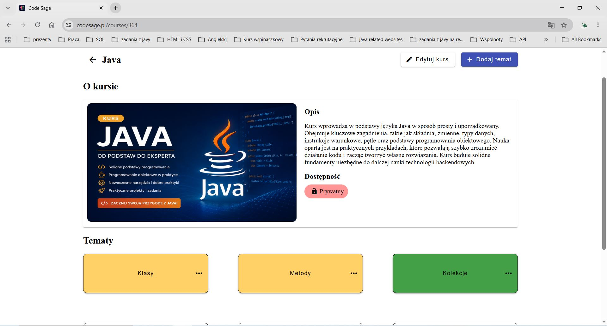
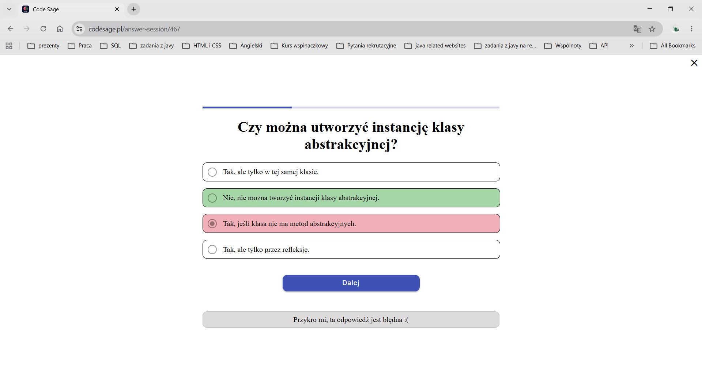
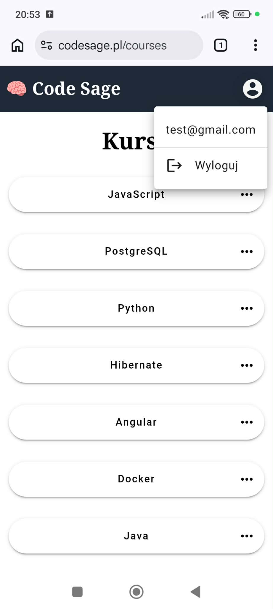

<h1 align="center">
    
    <a href="https://www.codesage.pl">CodeSage</a> Backend 
</h1>

A learning platform where users can create, share, and study programming courses.

🌐 Live application: [codesage.pl](https://www.codesage.pl)

The complete application consists of:
- CodeSage Backend (Spring Boot)
- CodeSage Frontend (Angular)

## Screenshots 

### Desktop view

<table>
  <td align="center">
    
  </td>
  <td align="center">
    
  </td>
</table>

### Mobile view

<table>
  <td align="center">
    
  </td>
  <td align="center">
    
  </td>
</table>

## Features

- Authentication and authorization
- Google OAuth2 login
- Course management
- Learning sessions
- Progress tracking
- Database migrations
- Custom resource-level authorization using Spring AOP and SpEL
- File storage integration
- Creation and sharing of courses, subjects, questions, and answers

## Technology Stack

- Java 11
- Spring Boot
- Spring Security
- Hibernate
- PostgreSQL
- Liquibase
- OAuth2 
- JUnit
- Mockito
- Docker
- AWS S3
